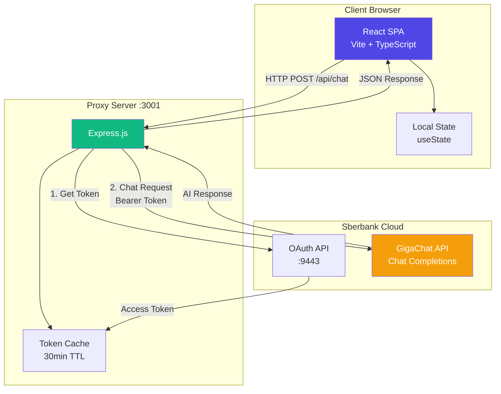
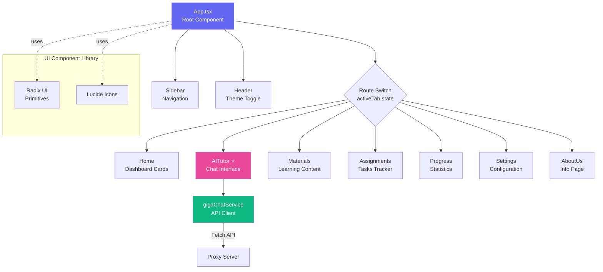
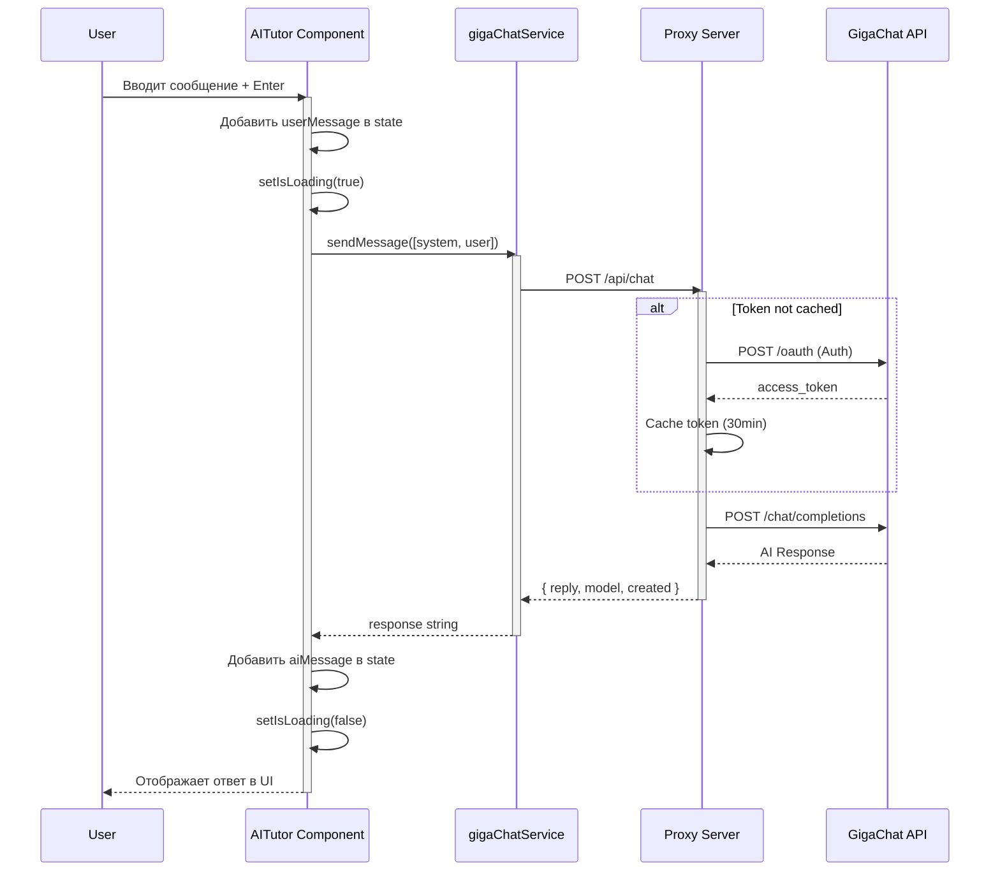
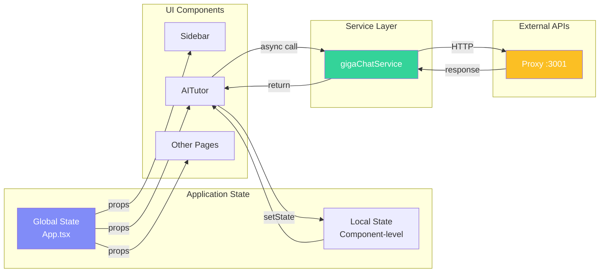
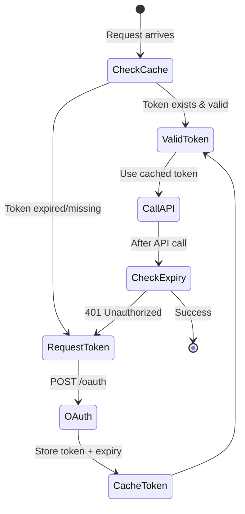
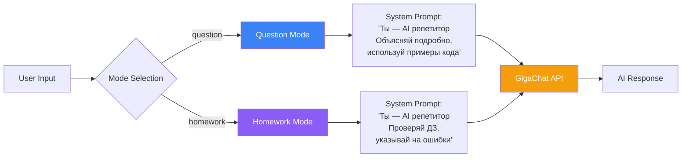
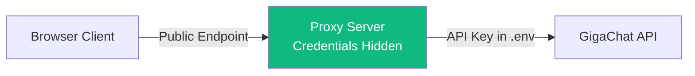

# 📐 Архитектура проекта BrainWave

## 1️⃣ Общая архитектура системы

## 2️⃣ Структура компонентов React

## 3️⃣ Архитектура компонента AITutor

## 4️⃣ Поток данных в приложении

## 5️⃣ OAuth 2.0 Flow с кэшированием

## 6️⃣ Режимы работы AI Репетитора

## 📊 Технологический стек

| Уровень | Технологии |
|---------|-----------|
| **Frontend** | React 18, TypeScript, Vite, Tailwind CSS |
| **UI Components** | Radix UI, Lucide Icons |
| **Backend** | Node.js, Express.js |
| **AI API** | GigaChat (Sberbank) |
| **State Management** | React useState (Local) |
| **HTTP Client** | Fetch API, node-fetch |

## 🔐 Безопасность

---

**Инструкция:**
1. Установите расширение [Markdown Preview Mermaid Support](vscode:extension/bierner.markdown-mermaid)
2. Откройте этот файл в VS Code
3. Нажмите `Ctrl+Shift+V` для preview
4. Сделайте скриншот или экспорт в PNG
